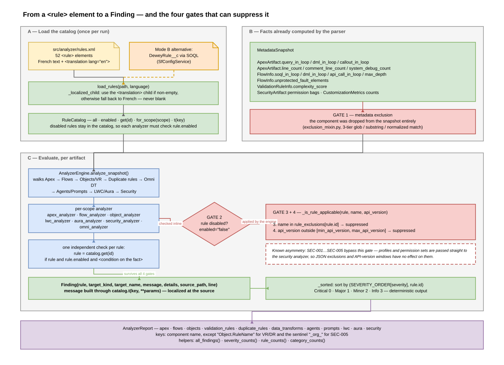
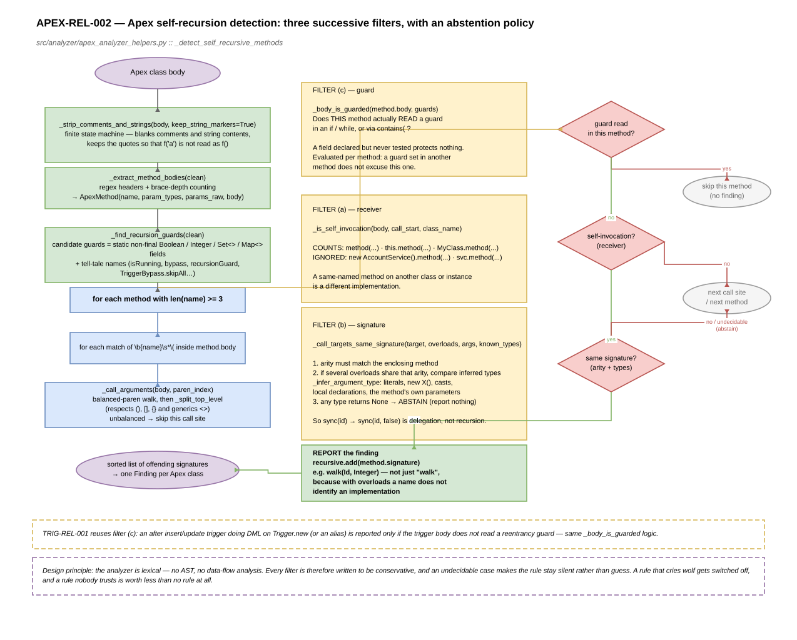
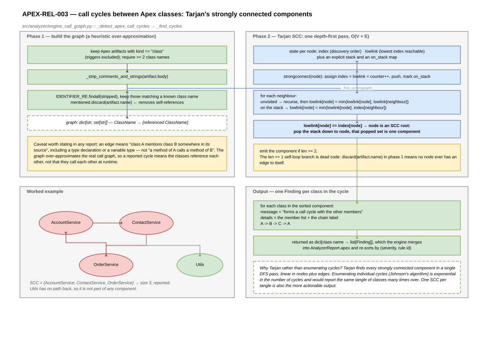

# Dewey — How the Analysis Rules Work

> **Generated file — do not edit.** This is [`ANALYSIS_RULES.md`](ANALYSIS_RULES.md) with the diagrams embedded as SVG instead of PNG. Edit the original, then run `python docs/architecture/_make_svg_docs.py`.


> **Audience** — engineers adding, tuning or debugging a rule, and reviewers who need to know how much to trust a finding.
> **Companion document** — [`ARCHITECTURE.svg.md`](ARCHITECTURE.svg.md) covers the surrounding application.
> **Scope** — the 52 rules declared in `src/analyzer/rules.xml`, the engine that evaluates them, and the parser-side algorithms that feed them.

---

## 1. The governing idea: facts are parsed, judgement is declared

Dewey is a **declarative rule engine in the tradition of PMD and ESLint**, with one architectural twist: the expensive, error-prone code inspection happens in the *parser*, not in the rules.

```
                  ┌──────────────── parser ────────────────┐   ┌──── analyzer ────┐
Apex / XML / JS ──►│ lexing, brace matching, graph walking │──►│ threshold checks │──► Finding
                  │  → facts on typed dataclasses          │   │  → rule + message │
                  └────────────────────────────────────────┘   └──────────────────┘
```

A rule such as `APEX-PERF-001` ("SOQL potentially executed inside a loop") does not contain a parser. It reads a boolean that `src/parsers/salesforce_parser/apex_helpers.py` computed earlier:

```114:116:src/analyzer/apex_analyzer.py
    # APEX-PERF-001 : SOQL in loop
    rule = catalog.get("APEX-PERF-001")
    if rule and rule.enabled and artifact.query_in_loop:
```

**Practical consequence**: when a finding is wrong, the fix is almost never in `src/analyzer/`. [§6](#6-where-each-rule-actually-decides) maps every rule to the module that actually decides.

There are exactly three families of exception, where the analyzer does its own inspection: the Apex recursion rules and the SOQL-injection rule (in `apex_analyzer_helpers.py`), the Apex call-cycle rule (in `engine_call_graph.py`), and the OmniStudio rules (which parse their own XML).

---

## 2. The rule catalog

### 2.1 `rules.xml` schema

`src/analyzer/rules.xml` is the source of truth in Mode A. Root element `<rules version="1.0">`, children `<rule>`:

```xml
<rule id="APEX-PERF-001" enabled="true" scope="apex_class" category="Easy"
      subcategory="Efficiency" severity="Critical" source="Best Practice"
      reference="https://developer.salesforce.com/..."
      min_api_version="10.0" max_api_version="100.0">
  <title>Requête SOQL potentiellement dans une boucle</title>
  <description>Une requête SOQL est exécutée à l'intérieur d'une boucle.</description>
  <rationale>Risque de dépassement des limites Governor (101 requêtes SOQL par transaction).</rationale>
  <remediation>Sortir la requête de la boucle et utiliser une collection (Map/Set) pour bulkifier.</remediation>
  <translation lang="en">
    <title>SOQL potentially executed inside a loop</title>
    <description>A SOQL query is executed inside a loop.</description>
    <rationale>Risk of exceeding Governor Limits (101 SOQL queries per transaction).</rationale>
    <remediation>Move the query out of the loop and use a collection (Map/Set) to bulkify.</remediation>
  </translation>
</rule>
```

| Attribute | Meaning |
|---|---|
| `id` | unique identifier, also the key used by exclusions and by `catalog.get()` |
| `enabled` | soft switch; only the exact string `"true"` (case-insensitive) is true, and a *missing* attribute defaults to true |
| `scope` | the artifact family the rule targets (see the 15 values in §2.3) |
| `category` | Well-Architected pillar: `Trusted`, `Easy` or `Adaptable` |
| `subcategory` | finer theme: `Secure`, `Reliable`, `Resilient`, `Efficiency`, `Maintainability`, `Readability`, `Composable` |
| `severity` | `Critical`, `Major`, `Minor`, `Info` |
| `source` | provenance label, e.g. `Best Practice`, `Well-Architected Reliable` |
| `reference` | documentation URL surfaced in the reports |
| `min_api_version` / `max_api_version` | inclusive API-version window |

French text sits at the rule root and is the readable default; English lives only inside `<translation lang="en">`. All 52 rules currently carry an English translation, and all 52 are enabled.

### 2.2 Loading — `rule_catalog.py`

`load_rules(path, language)` parses the XML with `xml.etree.ElementTree` and maps each element onto a `Rule` dataclass. Localizable children go through `_localized_child`: for a non-French language it looks for the `<translation>` block and uses its child **if non-empty**, otherwise it falls back to the French root child. An untranslated rule therefore degrades to French rather than rendering blank.

`RuleCatalog` wraps the list and exposes `all`, `enabled`, `get(rule_id)`, `is_enabled(rule_id)`, `for_scope(scope)`, and `t(key, **params)` — the latter delegating to the finding-message catalog in `src/analyzer/messages.py`.

Note that **disabled rules stay in the catalog**. Every analyzer therefore guards with `if rule and rule.enabled` before emitting, and `AnalyzerReport.rules_used` is set to `catalog.enabled`.

In Mode B this whole file is bypassed: `SfConfigService` builds an equivalent `RuleCatalog` from `DeweyRule__c` records fetched over SOQL.

### 2.3 Inventory

52 rules, distributed as:

| Dimension | Breakdown |
|---|---|
| **Scope** | `apex_class` 13 · `flow` 11 · `lwc` 5 · `object` 4 · `apex_trigger` 3 · `omni_data_transform` 3 · `profile` 3 · `validation_rule` 2 · `duplicate_rule` 2 · `aura` 1 · `field` 1 · `agent` 1 · `prompt` 1 · `permission_set` 1 · `org` 1 |
| **Severity** | Minor 22 · Major 14 · Critical 11 · Info 5 |
| **Category** | Easy 32 · Trusted 16 · Adaptable 4 |
| **Subcategory** | Maintainability 12 · Readability 12 · Secure 11 · Efficiency 8 · Reliable 5 · Resilient 3 · Composable 1 |

The distribution is worth reading as a statement of intent: the catalog is weighted towards *maintainability and readability* (24 of 52 rules), with a smaller core of security and reliability rules carrying most of the `Critical` severities. The full list with titles is in [§6](#6-where-each-rule-actually-decides).

### 2.4 `Rule` and `Finding`

Both are dataclasses in `src/analyzer/models.py`.

**`Rule`** mirrors the XML: `id`, `enabled`, `scope`, `category`, `subcategory`, `severity`, `source`, `reference`, `title`, `description`, `rationale`, `remediation`, `min_api_version`, `max_api_version`.

**`Finding`** is one violation: `rule`, `target_kind`, `target_name`, `message`, `details` (a list of supporting lines), `source_path`, `line`.

Ordering uses a single constant:

```12:17:src/analyzer/models.py
SEVERITY_ORDER: dict[str, int] = {
    "Critical": 0,
    "Major": 1,
    "Minor": 2,
    "Info": 3,
}
```

`Finding.severity_rank` exposes it, and the engine's `_sorted` helper sorts by `(severity, rule.id)` — so findings are deterministic, severity first, and the dataclasses need no comparison methods.

---

## 3. The evaluation pipeline



`AnalyzerEngine.analyze_snapshot()` (`src/analyzer/engine.py`) walks the snapshot family by family and fills the eleven dictionaries of `AnalyzerReport`:

1. **Apex** — every artifact through `analyze_apex`
2. **Apex call cycles** — one org-wide pass, merged into the Apex results and re-sorted
3. **Flows**
4. **Objects**, and each nested validation rule under the key `Object.RuleName`
5. **Duplicate rules**, from `snapshot.duplicate_rules`
6. **OmniStudio Data Transforms** — located by scanning `snapshot.inventory["omnistudio"]` for Data Transform paths, then re-reading each XML file from disk
7. **Agents and prompts** — checked inline in the engine
8. **LWC and Aura**
9. **Security** — profiles, permission sets, then the org-level ratio rule under the sentinel key `"_org_"`

### 3.1 The four suppression gates

A rule can be silenced at four different points, which is worth internalizing before debugging a "missing" finding:

| Gate | Mechanism | Where |
|---|---|---|
| **1. Component absent** | metadata exclusion removed it from the snapshot before analysis | `exclusion_mixin.py` |
| **2. Rule disabled** | `enabled="false"` in `rules.xml`, or `IsEnabled__c` in Mode B | checked by each analyzer |
| **3. Component exempted** | `rule_exclusions` maps a rule id to a set of component names | `engine_rule_exclusions.py` |
| **4. API version outside window** | `min_api_version` / `max_api_version` versus the component's API version | `engine_rule_exclusions.py` |

Gates 3 and 4 both live in `_is_rule_applicable`:

```73:78:src/analyzer/engine_rule_exclusions.py
    def _is_rule_applicable(self, rule: Rule, metadata_name: str, api_version: str | None = None) -> bool:
        """Verifie si une regle doit etre appliquee a une metadonnee donnee."""
        # 1. Verification de l'exclusion specifique
        if rule.id in self.rule_exclusions:
            if metadata_name.lower() in self.rule_exclusions[rule.id]:
                return False
```

**A known asymmetry**: the security rules bypass this gate. In `analyze_snapshot`, profiles and permission sets are passed straight to `analyze_profile` / `analyze_permission_set` without filtering, so JSON rule exclusions and API-version windows have no effect on `SEC-001` through `SEC-005`. Since the XML pins all `SEC-*` rules to `min_api_version = max_api_version = 60.0`, this bypass is currently what keeps them firing at all.

---

## 4. Named algorithms at a glance

| # | Algorithm | Classical name | Implementation | Feeds |
|---|---|---|---|---|
| 1 | Comment and string blanking | **finite state machine** (single-pass lexer) | `parsers/.../apex_helpers.py::_strip_apex_comments`, `analyzer/apex_analyzer_helpers.py::_strip_comments_and_strings` | every regex-based Apex rule |
| 2 | Loop-body extraction | **balanced-delimiter matching** (depth counter) | `parsers/.../apex_helpers.py::_detect_pattern_in_loop` | `APEX-PERF-001/002/003`, `TRIG-PERF-001` |
| 3 | Method-body extraction | balanced-delimiter matching | `analyzer/apex_analyzer_helpers.py::_extract_method_bodies` | `APEX-REL-002` |
| 4 | Overload resolution by arity and inferred types | **type inference with abstention** (local, conservative) | `_call_targets_same_signature`, `_infer_argument_type` | `APEX-REL-002` |
| 5 | Apex class cycle detection | **Tarjan's strongly connected components** | `analyzer/engine_call_graph.py::_find_cycles` | `APEX-REL-003` |
| 6 | Flow path enumeration | **iterative depth-first search**, path-local cycle avoidance | `parsers/.../flows_mixin.py::_flow_paths` | `FLOW-MAINT-003` |
| 7 | Flow loop-body reachability | **iterative DFS reachability** with a visited set | `parsers/.../flows_mixin.py::_is_node_reachable` | `FLOW-PERF-002/003/004` |
| 8 | Fault-path check | set filtering on connector labels | `models/automation.py::unprotected_fault_elements` | `FLOW-REL-001` |
| 9 | Flow complexity | **weighted linear scoring** plus bucketing | `models/automation.py::complexity_score` | `FLOW-MAINT-001/002` context |
| 10 | Validation-rule complexity | weighted token counting heuristic | `models/metadata.py::complexity_score` | `VR-MAINT-001` |
| 11 | Orphan detection | **set difference** on `(name, kind)` pairs | `parsers/.../orphan_detection_mixin.py` | reports (no rule) |
| 12 | Exclusion matching | **glob matching** (`fnmatch`) plus substring plus normalized compare | `parsers/.../exclusion_mixin.py::_is_excluded` | all four gates, gate 1 |
| 13 | Customization scoring | weighted linear scoring plus threshold bucketing | `models/metrics.py` | scores, no rule |
| 14 | Adoption posture | discrete classifiers plus **weighted average** | `core/customization_metrics/` | posture, no rule |

Two things Dewey deliberately does **not** do: it never builds an Apex abstract syntax tree, and it performs no data-flow or taint analysis. Every Apex rule is lexical — a state machine, a depth counter or a regex over blanked-out source. That is the single most important caveat when judging a finding's reliability, and it is why several rules are written to *abstain* when the evidence is ambiguous.

---

## 5. Algorithm deep dives

### 5.1 Comment and string blanking — a finite state machine

Every Apex rule that uses a regex must first neutralize comments and string literals, otherwise the word `insert` inside a comment, or `'SELECT'` inside a string, produces a false positive.

The implementation is a single-pass character scanner with the states *code*, *line comment*, *block comment* and *inside string literal*, handling backslash escapes. Crucially it **blanks rather than deletes**: each suppressed character becomes a space, and newlines are preserved. Offsets and line numbers in the cleaned text therefore still match the original file, which is what lets a finding report an accurate line number.

There are two implementations, by design: the parser's `_strip_apex_comments` and the analyzer's `_strip_comments_and_strings`. The analyzer version takes an extra `keep_string_markers` parameter that retains the enclosing quotes while still blanking the contents — needed by the recursion rule, because otherwise `f('a')` and `f()` become indistinguishable when counting arguments.

### 5.2 SOQL, DML and callouts inside loops — balanced-delimiter matching

`_detect_pattern_in_loop` (`src/parsers/salesforce_parser/apex_helpers.py`) is the reason Dewey's "in a loop" rules are worth more than a naive grep. A regex like `for[\s\S]*SELECT` would flag any query written *after* a loop. Instead, the function delimits the loop body exactly:

1. Blank comments and strings.
2. Find the next `for`, `while` or `do` keyword.
3. For `for` / `while`, skip the condition by **counting parenthesis depth** — necessary because conditions nest.
4. Reach the opening brace, then walk forward with a **brace depth counter** from 1 until it returns to 0. That position is the true end of the body.
5. Search the target pattern *only* inside `[body_start, body_end)`.
6. Report a 1-based line number by counting newlines up to the match.
7. Resume scanning after the loop, which naturally handles sequential and nested loops.

```168:179:src/parsers/salesforce_parser/apex_helpers.py
        body_start = pos + 1
        depth = 1
        pos += 1
        while pos < n and depth > 0:
            if clean[pos] == "{":
                depth += 1
            elif clean[pos] == "}":
                depth -= 1
            pos += 1
        body_end = pos - 1  # exclusive; points at char after '}'

        hit = pattern.search(clean, body_start, body_end)
```

Two deliberate behaviours: a brace-less single-statement loop is still checked, by scanning to the next semicolon; and a query in the loop *header* — the recommended `for (SObject s : [SELECT ...])` — falls outside the body and is correctly not reported.

This one function serves `APEX-PERF-001` (SOQL), `APEX-PERF-002` (DML), `APEX-PERF-003` (`new Http…` callouts) and `TRIG-PERF-001`, each with a different pattern.

### 5.3 Apex self-recursion — three filters and an abstention policy



`APEX-REL-002` is the most elaborate rule in the catalog, because naive name matching produces unacceptable noise: any method that delegates to an overload of itself looks recursive. `_detect_self_recursive_methods` (`src/analyzer/apex_analyzer_helpers.py`) therefore extracts methods into an `ApexMethod` record (name, parameter types, raw parameters, body) via brace counting, then applies three successive filters.

**Filter (a) — receiver.** Only an unqualified call, `this.method(...)`, or `MyClass.method(...)` counts as self-invocation. A qualified call to a same-named method on another class or a new instance — `new AccountService().completeSirenisation(...)` — is a different implementation and is ignored.

**Filter (b) — signature.** Argument arity must match the enclosing method's. When several overloads share that arity, argument types are inferred and compared: literals, `new X()`, casts, local variable declarations and the method's own parameters. `_infer_argument_type` returns `None` for anything it cannot decide — a call result, a compound expression — and an undecidable type makes the rule **abstain** rather than guess. So `sync(id)` calling `sync(id, false)` is not reported.

**Filter (c) — guard.** A recursion protected by a reentrancy guard is intentional. `_find_recursion_guards` collects candidate guards from two sources: `static` non-`final` fields of a state-bearing type (`Boolean`, `Integer`, `Set<>`, `Map<>`), and identifiers whose name betrays the intent (`isRunning`, `bypass`, `recursionGuard`, `TriggerBypass.skipAll`, …). `_body_is_guarded` then requires the guard to be **actually read** — in an `if`/`while` condition, or through `contains(`. A field declared and never tested protects nothing.

Two refinements matter for accuracy. The guard is evaluated **per method**, so a guard set in one method does not excuse unguarded recursion in another. And each finding carries the offending **signature**, `walk(Id, Integer)`, not just the name — with overloads, a name does not identify an implementation.

`TRIG-REL-001` (an after-insert/update trigger issuing DML on `Trigger.new`) reuses the same `_body_is_guarded` logic.

### 5.4 Apex call cycles — Tarjan's strongly connected components



`APEX-REL-003` is the only genuinely org-wide Apex rule, implemented in `src/analyzer/engine_call_graph.py` in two phases.

**Graph construction** is a heuristic, and its limits should be stated plainly. For each Apex *class* (triggers excluded), the body is blanked of comments and strings, all identifiers are extracted, and those matching a known class name become outbound edges. This means a class merely *mentioned* in a type declaration or a comment-free string-free reference counts as "called". The graph is an over-approximation of the real call graph, so a reported cycle means "these classes reference each other", not "these methods call each other at runtime".

**Cycle extraction is a textbook Tarjan SCC**: per-node `index` and `lowlink`, an explicit stack with an `on_stack` map, a recursive `strongconnect`, and an SCC emitted when `lowlink[node] == index[node]`.

```101:112:src/analyzer/engine_call_graph.py
        if lowlink[node] == index[node]:
            component: list[str] = []
            while True:
                w = stack.pop()
                on_stack[w] = False
                component.append(w)
                if w == node:
                    break
            if len(component) >= 2:
                sccs.append(component)
            elif node in graph.get(node, set()):
                sccs.append(component)
```

Tarjan is the right choice here: it finds all strongly connected components in a single depth-first pass, O(V + E), whereas enumerating cycles individually (Johnson's algorithm) would be exponential in output size and would report the same tangle many times over.

One dead branch is worth noting for future readers: construction calls `mentioned.discard(artifact.name)`, so self-loops never exist in the graph, and the `elif node in graph.get(node, ...)` self-loop case can never fire. A class referencing only itself is not reported. The rule also returns early unless at least two class names exist. Being recursive, the traversal is bounded by Python's recursion limit rather than by an explicit guard — not a practical concern at realistic org sizes, where SCC depth stays small.

### 5.5 Flow graph analysis — two different DFS walks

Flows are directed graphs, and the parser (`src/parsers/salesforce_parser/flows_mixin.py`) builds an adjacency map `element name → [targets]` from every connector kind: the default `connector`, each decision `rule`, `defaultConnector`, the loop's `nextValueConnector` and `noMoreValuesConnector`, and `faultConnector` (tagged with the label `"Fault"`, which is what `FLOW-REL-001` later keys on).

**`_flow_paths` — path enumeration for depth.** An iterative DFS with an explicit LIFO stack of `(node, path)` pairs, enumerating root-to-leaf paths. Cycle avoidance is **path-local** (`neighbor not in path`) rather than a global visited set, which is what makes full enumeration possible — the same node may legitimately appear on several distinct paths. The trade-off is exponential blow-up on densely branching flows, capped by a hard `safeguard < 5000` iteration budget. From the resulting paths the parser derives `min_height` / `max_height` (path lengths) and `max_depth` — the maximum number of *structural* nodes (decisions, loops, subflows) along any single path, which is what `FLOW-MAINT-003` thresholds at 4.

**`_is_node_reachable` — reachability for loop bodies.** A second, cheaper DFS, this time with a **global visited set**, answering "starting from this loop's `nextValueConnector`, can I reach a Get Records / Create / Update / Delete / External Service node before coming back to the loop element?". The loop element itself is the traversal boundary, standing in for one iteration:

```314:320:src/parsers/salesforce_parser/flows_mixin.py
        while stack:
            current = stack.pop()
            if current == end_node:
                continue
            if current in visited:
                continue
            visited.add(current)
```

This sets `soql_in_loop`, `dml_in_loop` and `api_call_in_loop`, which `FLOW-PERF-002`, `-003` and `-004` read. With `collect_matches` supplied, it gathers every matching node so the finding can name the offending actions instead of just asserting the problem.

### 5.6 Weighted linear scoring

Three scores use the same shape — multiply counts by weights, sum, then bucket into four levels by three breakpoints.

**Flow complexity** (`src/core/models/automation.py`):

```
score = total_elements
      + decisions × 3
      + loops     × 4
      + subflows  × 2
      + data_ops  × 2
      + max_depth × 4
      + max(0, max_width - 1) × 2
      + undocumented_elements
```

Bucketed as `Simple` (< 20), `Moyen` (< 45), `Complexe` (< 80), `Tres complexe` otherwise. The weights encode a defensible opinion: branching and nesting cost more than raw element count, and undocumented elements are charged as if each were an extra element.

**Customization scoring** (`src/core/models/metrics.py`) applies `DEFAULT_SCORING_WEIGHTS` — for instance `custom_objects: 8`, `apex_classes: 3`, `custom_fields: 1`, `agents: 5` — grouped into three families:

- `score_no_code` — objects, fields, record types, validation rules, layouts, tabs, apps, Einstein predictions
- `score_low_code` — flows, all OmniStudio types, Business Rules Engine matrices and expression sets, GenAI prompts
- `score_pro_code` — Apex classes, Apex triggers, agents

Their sum is `score`, bucketed by `DEFAULT_SCORING_THRESHOLDS = (50, 150, 350)`. A second, independent weight set (`DEFAULT_ADOPT_ADAPT_WEIGHTS`, thresholds `(100, 300, 600)`) produces the posture label from `Adopt (Standard)` to `Adapt (High Customization)`.

**Adoption posture** (`src/core/customization_metrics/`) works differently and is worth distinguishing: nine capabilities (data model, security, automation, validation, UI/layout, integration, reporting, notifications, OmniStudio) each carry a weight summing to 20, and a per-capability **discrete classifier** in `assessors.py` assigns one of four levels (`Adopt (OOTB)`, `Adopt declaratif`, `Adapt (declaratif)`, `Adapt (code)`). The result is a weighted average, `percent_adoption = adopt_weight / total_weight × 100`. No clustering is involved, despite the output looking like a maturity model.

**Validation-rule complexity** (`src/core/models/metadata.py`) is a frank heuristic: `len(formula) // 50`, plus the counts of `(`, `IF`, `AND`, `OR` and `CASE`. These are case-sensitive substring counts, so a field named `ORDER__c` inflates the `OR` tally. `VR-MAINT-001` fires above 15.

### 5.7 Three-tier exclusion matching

`_is_excluded(category, *names)` (`exclusion_mixin.py`) is generous on purpose, so that an admin can exclude components without learning a pattern syntax. Each pattern from the target category *plus* the special `all` category is tested against each candidate name (API name and label both), in three escalating ways:

1. **Glob match** via `fnmatch.fnmatch`, case-insensitive, supporting `*` and `?`
2. **Substring match** — `pattern in name`, so a bare keyword works without wildcards
3. **Normalized match** — spaces and underscores stripped from both sides, absorbing naming variants (`SF Async` matches `SF_Async__c`)

Any one match excludes the component. Category names themselves are normalized through `CATEGORY_ALIASES` in `base.py`, which maps French and English synonyms (`object`, `objet`, `sobject`) onto canonical keys.

The generosity has a cost: substring matching means a short pattern like `Acc` silently excludes far more than intended. It is the right default for the tool's audience, but worth knowing when an expected component is missing from a report.

### 5.8 Orphan detection — set difference

Not a rule, but the same style of reasoning. `dependencies_mixin.py` builds `snapshot.dependencies` by scanning every source artifact (Apex with SOQL field extraction, object relationships, validation-rule formulas, formula fields, Flows, LWC, Aura, reports, layouts, FlexiPages, OmniStudio) for known names. Orphan detection then reduces the edge list to `used_targets = {(target_name, target_kind)}` and reports any custom component absent from that set.

Exceptions encode entry-point knowledge: triggers are entry points, test classes are skipped, standard objects are never orphans, and only `Flow` / `AutoLaunchedFlow` process types without a trigger type are eligible.

---

## 6. Where each rule actually decides

The **Decided by** column is the module to open when a finding looks wrong.

### Apex classes (13)

| Rule | Severity | Title | Detection technique | Decided by |
|---|---|---|---|---|
| `APEX-SEC-001` | Critical | Apex class without an explicit sharing declaration | flag from the parsed class header | `apex_mixin.py` |
| `APEX-SEC-002` | Major | Hardcoded Salesforce ID | regex for 15/18-char IDs, filtered by known key prefixes | `apex_analyzer_helpers.py` |
| `APEX-SEC-003` | Critical | SOQL injection risk detected | `Database.query(...)` argument shows `+` or `$` with no `escapeSingleQuotes` and no bind variable | `apex_analyzer_helpers.py` |
| `APEX-SEC-004` | Major | No explicit CRUD/FLS enforcement | SOQL/DML present but no `USER_MODE` / `stripInaccessible` / `isAccessible` token found | `apex_analyzer.py` |
| `APEX-REL-001` | Major | No try/catch around DML or SOQL processing | parsed `has_try_catch` versus operation counts | `apex_mixin.py` |
| `APEX-PERF-001` | Critical | SOQL potentially executed inside a loop | brace-aware loop body extraction (§5.2) | `parsers/apex_helpers.py` |
| `APEX-PERF-002` | Critical | DML potentially executed inside a loop | same | `parsers/apex_helpers.py` |
| `APEX-PERF-003` | Critical | HTTP callout potentially executed inside a loop | same, pattern `new Http…` | `parsers/apex_helpers.py` |
| `APEX-REL-002` | Major | Apex method suspected of unguarded recursion | three filters, overload resolution, abstention (§5.3) | `apex_analyzer_helpers.py` |
| `APEX-REL-003` | Major | Call cycle detected between several Apex classes | Tarjan SCC over a mention-based graph (§5.4) | `engine_call_graph.py` |
| `APEX-MAINT-001` | Minor | Apex class too long | `line_count > 500` | `apex_analyzer.py` |
| `APEX-MAINT-002` | Minor | Low comment density | density `< 5%` when `line_count > 80` | `apex_analyzer.py` |
| `APEX-MAINT-003` | Minor | Too many leftover System.debug calls | `system_debug_count > 10` | `apex_analyzer.py` |

### Apex triggers (3)

| Rule | Severity | Title | Detection technique | Decided by |
|---|---|---|---|---|
| `TRIG-MAINT-001` | Major | Business logic directly inside the trigger | non-comment line count `> 10`, or any DML/SOQL present | `apex_analyzer.py` |
| `TRIG-REL-001` | Critical | After insert/update trigger rewriting its triggering records | after-event header regex plus DML on `Trigger.new` or an alias, guard-aware | `apex_analyzer_helpers.py` |
| `TRIG-PERF-001` | Critical | SOQL or DML inside a trigger loop | brace-aware loop body extraction | `parsers/apex_helpers.py` |

### Flows (11)

| Rule | Severity | Title | Detection technique | Decided by |
|---|---|---|---|---|
| `FLOW-READ-001` | Minor | Flow without a global description | empty description | `flow_analyzer.py` |
| `FLOW-READ-002` | Minor | Fewer than 50% of elements described | documented ratio `< 0.5` | `flow_analyzer.py` |
| `FLOW-MAINT-001` | Major | Oversized flow | `total_elements > 40` | `flow_analyzer.py` |
| `FLOW-MAINT-002` | Minor | Too many decisions in the flow | `decisions > 8` | `flow_analyzer.py` |
| `FLOW-MAINT-003` | Minor | Excessive nesting depth | `max_depth > 4`, from DFS path enumeration (§5.5) | `flows_mixin.py` |
| `FLOW-PERF-001` | Major | Heavy data footprint | create + update + delete + lookup `> 6` | `flow_analyzer.py` |
| `FLOW-PERF-002` | Critical | SOQL (Get Records) inside a Flow loop | DFS reachability from the loop connector (§5.5) | `flows_mixin.py` |
| `FLOW-PERF-003` | Critical | DML inside a Flow loop | same | `flows_mixin.py` |
| `FLOW-PERF-004` | Critical | External Service action call inside a Flow loop | same, restricted to `externalService` action types | `flows_mixin.py` |
| `FLOW-REL-001` | Major | Flow element without a fault path | fault-capable elements with no connector labelled `Fault` | `models/automation.py` |
| `FLOW-ADAPT-001` | Info | Inactive flow present in the package | status not in `{active, obsolete}` | `flow_analyzer.py` |

### Objects, fields and rules (9)

| Rule | Severity | Title | Detection technique | Decided by |
|---|---|---|---|---|
| `OBJ-READ-001` | Minor | Custom object without a description | custom and description empty | `object_analyzer.py` |
| `OBJ-ADAPT-001` | Minor | Object with a large number of custom fields | custom fields `> 50` | `object_analyzer.py` |
| `OBJ-MAINT-001` | Minor | Many validation rules on the object | active VRs `> 10` | `object_analyzer.py` |
| `OBJ-MAINT-002` | Info | Several active record types | active record types `> 3` | `object_analyzer.py` |
| `FIELD-READ-001` | Minor | Custom field without a description | undocumented custom fields aggregated into one finding per object | `object_analyzer.py` |
| `VR-READ-001` | Minor | Validation rule without a description | empty description | `object_analyzer.py` |
| `VR-MAINT-001` | Minor | Very long validation formula | `complexity_score > 15` (§5.6) | `models/metadata.py` |
| `DR-READ-001` | Minor | Duplicate rule without a description | empty description | `object_analyzer.py` |
| `DR-SEC-001` | Major | Duplicate rule enforcing sharing rules | `security_enforcement == "EnforceSharingRules"` | `object_analyzer.py` |

### UI components (6)

| Rule | Severity | Title | Detection technique | Decided by |
|---|---|---|---|---|
| `LWC-MAINT-001` | Minor | LWC JavaScript component too large | JS lines `> 300` | `lwc_analyzer.py` |
| `LWC-MAINT-002` | Minor | LWC HTML template too large | HTML lines `> 200` | `lwc_analyzer.py` |
| `LWC-MAINT-003` | Info | console.log present in the LWC code | re-reads the `.js` file, substring search | `lwc_analyzer.py` |
| `LWC-SEC-001` | Major | Use of @AuraEnabled in an LWC | parsed flag | `components_mixin.py` |
| `LWC-READ-001` | Minor | LWC component without a label or description | missing metadata | `lwc_analyzer.py` |
| `AURA-MAINT-001` | Major | Oversized Aura component | CMP lines `> 200` or JS lines `> 300` | `aura_analyzer.py` |

### OmniStudio, agents and prompts (5)

| Rule | Severity | Title | Detection technique | Decided by |
|---|---|---|---|---|
| `OMNI-READ-001` | Minor | Data Transform without a description | XML parsed on demand, empty description | `omni_analyzer.py` |
| `OMNI-MAINT-001` | Minor | Disabled Data Transform items left behind | items with `disabled="true"` `> 3` | `omni_analyzer.py` |
| `OMNI-ADAPT-001` | Info | Oversized Data Transform | item count `> 40` | `omni_analyzer.py` |
| `AGENT-READ-001` | Minor | Agent without a description | empty description | `engine.py` (inline) |
| `PROMPT-READ-001` | Minor | Prompt Template without a description | empty description | `engine.py` (inline) |

### Security (5)

| Rule | Severity | Title | Detection technique | Decided by |
|---|---|---|---|---|
| `SEC-001` | Critical | Profile with the ModifyAllData permission | custom profile with that user permission enabled | `security_analyzer.py` |
| `SEC-002` | Major | Profile with the ManageUsers permission | same, `ManageUsers` | `security_analyzer.py` |
| `SEC-003` | Major | Profile with ModifyAllRecords on an object | any object permission with `modify_all_records` | `security_analyzer.py` |
| `SEC-004` | Minor | Permission Set with ModifyAllRecords on a sensitive object | intersection with the `_SENSITIVE_OBJECTS` set | `security_analyzer.py` |
| `SEC-005` | Info | High ratio of custom profiles to Permission Sets | `custom_profiles / max(1, permission_sets) × 100` against a threshold | `security_analyzer.py` |

---

## 7. Thresholds and their configurability

This is the weakest point of the current design and the thing most likely to surprise you: **almost every rule threshold is a literal in its analyzer module**, not a value in `rules.xml` or a setting.

| Threshold | Value | Rule | Location |
|---|---|---|---|
| Apex class lines | 500 | `APEX-MAINT-001` | `apex_analyzer.py` |
| Comment density / min lines | 5% / 80 | `APEX-MAINT-002` | `apex_analyzer.py` |
| `System.debug` count | 10 | `APEX-MAINT-003` | `apex_analyzer.py` |
| Trigger code lines | 10 | `TRIG-MAINT-001` | `apex_analyzer.py` |
| Flow described ratio | 50% | `FLOW-READ-002` | `flow_analyzer.py` |
| Flow elements | 40 | `FLOW-MAINT-001` | `flow_analyzer.py` |
| Flow decisions | 8 | `FLOW-MAINT-002` | `flow_analyzer.py` |
| Flow data operations | 6 | `FLOW-PERF-001` | `flow_analyzer.py` |
| Flow depth | 4 | `FLOW-MAINT-003` | `flow_analyzer.py` |
| Custom fields per object | 50 | `OBJ-ADAPT-001` | `object_analyzer.py` |
| Active validation rules | 10 | `OBJ-MAINT-001` | `object_analyzer.py` |
| Active record types | 3 | `OBJ-MAINT-002` | `object_analyzer.py` |
| VR complexity | 15 | `VR-MAINT-001` | `object_analyzer.py` |
| LWC JS / HTML lines | 300 / 200 | `LWC-MAINT-001/002` | `lwc_analyzer.py` |
| Aura CMP / JS lines | 200 / 300 | `AURA-MAINT-001` | `aura_analyzer.py` |
| Omni disabled items / size | 3 / 40 | `OMNI-MAINT-001`, `OMNI-ADAPT-001` | `omni_analyzer.py` |

Exactly one rule threshold is wired to configuration, and it has a subtlety. `SEC-005` reads the *first* band of the configurable ratio thresholds:

```232:235:src/analyzer/engine.py
        _ratio_thresholds = (
            snapshot.metrics.profiles_ps_ratio_thresholds or DEFAULT_PROFILES_PS_RATIO_THRESHOLDS
        )
        ratio_threshold = _ratio_thresholds[0]
```

With `DEFAULT_PROFILES_PS_RATIO_THRESHOLDS = (30, 60, 100)`, the effective threshold is **30%**, not the `60` that `analyze_org_security` declares as its parameter default. That function default is dead code on this path. The value is user-editable through `src/ui/threshold_screen.py`, which writes `profiles_ps_ratio_thresholds` into `app_settings.json` and onto `snapshot.metrics`.

The scoring thresholds in `src/core/models/metrics.py` (`DEFAULT_SCORING_THRESHOLDS`, `DEFAULT_ADOPT_ADAPT_THRESHOLDS`, `DEFAULT_DATA_MODEL_THRESHOLDS`, `DEFAULT_PROFILES_THRESHOLDS`) are all overridable from the same screen, since they drive scores rather than rules.

In Mode B, `DeweyConfig__c` is the intended home for thresholds. Moving the literals above behind that mechanism is the obvious next step for anyone tasked with making the catalog tunable per client.

---

## 8. Adding a rule

1. **Declare it** in `src/analyzer/rules.xml`: a unique id following the `SCOPE-THEME-NNN` convention, the Well-Architected `category` and `subcategory`, a `severity`, and all four text children plus an English `<translation>`. Without the translation the rule renders in French inside an English report.
2. **Decide where detection belongs.** If it needs to inspect source code or walk a graph, compute the fact in the parser and store it on the dataclass; the rule then reads a field. Only put inspection in the analyzer if it is cheap and self-contained.
3. **Implement the check** in the analyzer module matching the scope. Follow the established shape: fetch the rule, verify `rule.enabled`, evaluate the condition, emit a `Finding` with a message built through `catalog.t(...)` and a line number when one is available.
4. **Add the message keys** to both language blocks of `src/analyzer/messages.py`. The test suite includes parity guards that fail when a key or a placeholder exists in one language only.
5. **Make the engine call it**, if you added a new artifact family — a dispatch method on `AnalyzerEngine`, a loop in `analyze_snapshot`, and a dictionary on `AnalyzerReport`.
6. **Test it.** `tests/` holds targeted suites per algorithm; `tests/test_apex_self_recursion.py` is a good model, covering true positives, the false positives that were deliberately excluded, and the abstention cases.

Prefer abstention to a guess. Several rules here are built to stay silent when the evidence is ambiguous, because a lexical analyzer that cries wolf gets switched off — and a rule nobody trusts is worth less than no rule at all.
