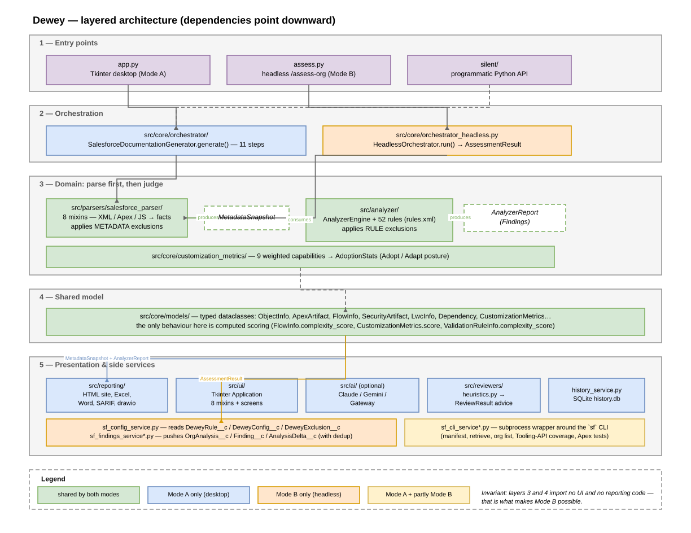
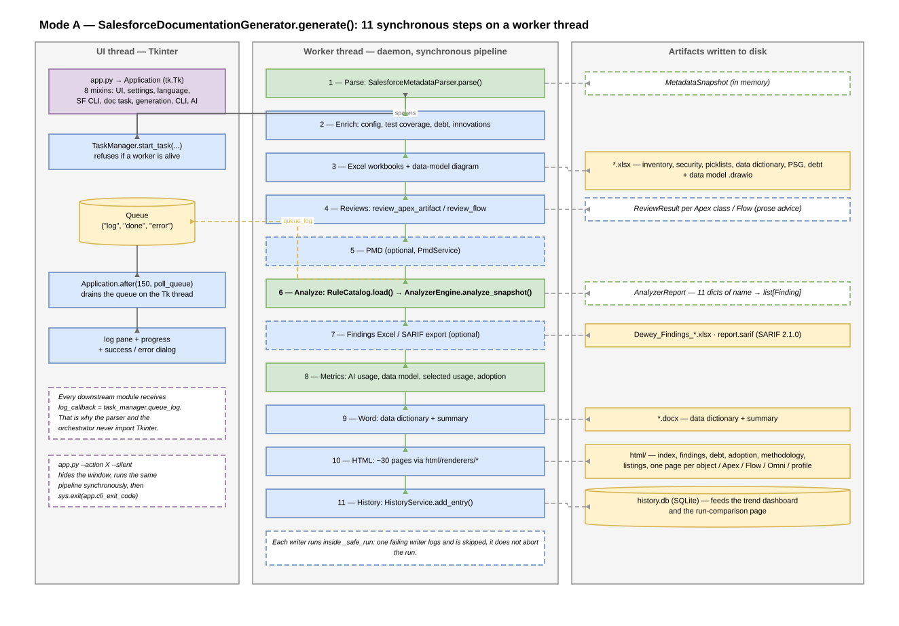
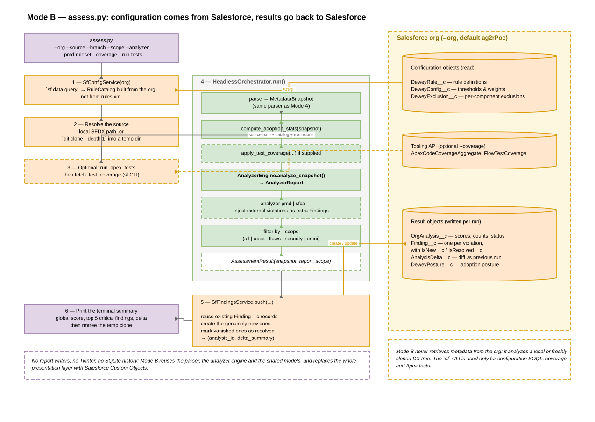

# Dewey — Application Architecture

> **Generated file — do not edit.** This is [`ARCHITECTURE.md`](ARCHITECTURE.md) with the diagrams embedded as SVG instead of PNG. Edit the original, then run `python docs/architecture/_make_svg_docs.py`.


> **Audience** — engineers joining the codebase, or integrators embedding Dewey in another pipeline.
> **Companion document** — [`ANALYSIS_RULES.svg.md`](ANALYSIS_RULES.svg.md) explains how individual rules detect what they detect.
> **Diagrams** — the `.drawio` sources referenced throughout live in [`diagrams/`](diagrams/). See [§10](#10-diagram-index) for the full list and where each one belongs.

---

## 1. What Dewey is

Dewey reads a **Salesforce DX source tree** (`force-app/main/default/...`) from disk and produces two kinds of output:

1. **Documentation** — a static HTML site, Excel workbooks, a Word document, a data-model diagram.
2. **An assessment** — a list of rule violations (*findings*) plus customization and adoption scores.

Dewey never talks to a Salesforce org to *read metadata*. Metadata arrives on disk beforehand, either because the user pointed Dewey at an existing SFDX project, or because Dewey shelled out to the `sf` CLI to retrieve it (see [§7](#7-salesforce-cli-integration)).

### 1.1 Two coexisting modes

| | **Mode A** — desktop | **Mode B** — headless |
|---|---|---|
| Entry point | `app.py` | `assess.py` |
| UI | Tkinter (`src/ui/`) | none, stdout only |
| Configuration source | `app_settings.json` + `rules.xml` + `exclusion.json` | Salesforce Custom Objects (`DeweyRule__c`, `DeweyConfig__c`, `DeweyExclusion__c`) |
| Orchestrator | `SalesforceDocumentationGenerator` (`src/core/orchestrator/`) | `HeadlessOrchestrator` (`src/core/orchestrator_headless.py`) |
| Output | HTML / Excel / Word / SARIF / drawio on disk, history in SQLite | Custom Objects pushed back to the org |
| Run trigger | user clicks, or `app.py --action ... --silent` | the `/assess-org` Claude Code skill |

A third, smaller surface exists: the **`silent/` package**, a programmatic Python API that drives the Mode A generator with reporting turned off and exposes the resulting numbers as properties. It is meant for embedding Dewey in a script, not for end users.

The governing constraint from `CLAUDE.md` is that **Mode B is an extension, not a fork**: it reuses the parser, the analyzer engine and the shared models, and adds its own configuration and result-persistence services.

---

## 2. Layered architecture



Five layers, with dependencies pointing strictly downward:

```
┌─ Entry points ──────────────────────────────────────────────┐
│  app.py (Mode A)        assess.py (Mode B)     silent/      │
└─────────────────────────────────────────────────────────────┘
┌─ Orchestration ─────────────────────────────────────────────┐
│  src/core/orchestrator/          src/core/orchestrator_     │
│  (Mode A, 7 modules)             headless.py (Mode B)       │
└─────────────────────────────────────────────────────────────┘
┌─ Domain: parsing then analysis ─────────────────────────────┐
│  src/parsers/salesforce_parser/  →  MetadataSnapshot        │
│  src/analyzer/                   →  AnalyzerReport          │
│  src/core/customization_metrics/ →  AdoptionStats           │
└─────────────────────────────────────────────────────────────┘
┌─ Shared model ──────────────────────────────────────────────┐
│  src/core/models/  (dataclasses, no behaviour beyond        │
│                     computed scoring properties)            │
└─────────────────────────────────────────────────────────────┘
┌─ Presentation & side services ──────────────────────────────┐
│  src/reporting/  src/ui/  src/ai/  src/reviewers/  (Mode A) │
│  src/core/sf_*_service.py                          (Mode B) │
└─────────────────────────────────────────────────────────────┘
```

**The load-bearing invariant**: `src/parsers/`, `src/analyzer/` and `src/core/models/` import no UI and no reporting code. That is what makes Mode B possible at all, and what lets the test suite exercise the analysis engine without a display.

### 2.1 Mode boundaries, package by package

| Package | Mode A | Mode B | Notes |
|---|---|---|---|
| `src/parsers/salesforce_parser/` | yes | yes | shared |
| `src/analyzer/` | yes | yes | shared |
| `src/core/models/` | yes | yes | shared |
| `src/core/customization_metrics/` | yes | yes | shared |
| `src/core/orchestrator/` | yes | no | Mode A pipeline |
| `src/core/orchestrator_headless.py` | no | yes | Mode B pipeline |
| `src/reporting/` | yes | no | HTML/Excel/Word/SARIF/drawio |
| `src/ui/` | yes | no | Tkinter |
| `src/ai/` | yes | no | optional LLM features |
| `src/reviewers/` | yes | no | prose advice for HTML pages |
| `src/core/sf_config_service.py`, `sf_findings_service*.py` | no | yes | Salesforce read/write of config & results |
| `src/core/sf_cli_service*.py` | yes | partly | Mode B uses it only for coverage and tests |
| `src/core/history_service.py` | yes | no | SQLite run history |

---

## 3. The two-stage domain: parse, then analyze

This separation is the most important thing to understand about the codebase, because it determines where to look when a rule misbehaves.

```
SFDX folder ──► PARSING ──► MetadataSnapshot ──► ANALYSIS ──► AnalyzerReport
               (facts)                          (judgement)
```

**Parsing makes no qualitative judgement.** It turns XML, Apex and JavaScript into typed dataclasses, and it computes *facts* — including some genuinely non-trivial ones such as "this SOQL query sits inside a loop body" or "this Flow's deepest path crosses 6 structural nodes". It also applies **metadata exclusions**: components dropped from the snapshot entirely.

**Analysis holds the opinions.** It loads a declarative rule catalog and compares the parsed facts against thresholds, emitting a `Finding` per violation. It applies **rule-level exclusions**: a specific rule silenced for a specific component.

So a false positive on `APEX-PERF-001` ("SOQL in a loop") is almost never a bug in `apex_analyzer.py` — that module only reads a boolean. The detection lives in the parser, in `src/parsers/salesforce_parser/apex_helpers.py`. `ANALYSIS_RULES.md` maps every rule to the module that actually decides.

### 3.1 `MetadataSnapshot` — the single parsing output

Defined in `src/core/models/snapshot.py`. One dataclass carrying everything parsed:

- **Metadata collections** — `objects`, `profiles`, `permission_sets`, `permission_set_groups`, `apex_artifacts`, `flows`, `agents`, `gen_ai_prompts`, `sharing_rules`, `duplicate_rules`, `lwc`, `aura`
- **Derived graphs** — `dependencies` (list of `Dependency` edges), `orphans`, `redundant_flows`
- **Human-authored annotations** — `technical_debt`, `deviations`, `innovations`, `innovation_colors`
- **Scores and counts** — `metrics` (a `CustomizationMetrics`), `inventory` (flat row dicts per component family), `ai_usage_stats`, `data_model_stats`, `adoption_stats`
- **Provenance** — `source_dir`, `package_roots`
- `findings_summary`, populated after analysis for convenience

### 3.2 `AnalyzerReport` — the single analysis output

Defined in `src/analyzer/engine.py`. Eleven dictionaries of `component name → list[Finding]`, one per artifact family: `apex`, `flows`, `objects`, `validation_rules`, `duplicate_rules`, `data_transforms`, `agents`, `prompts`, `lwc`, `aura`, `security`. Plus `rules_used`, the enabled rules of the catalog.

Aggregation helpers: `all_findings()`, `severity_counts()`, `rule_counts()`, `category_counts()`.

Two keying conventions worth knowing: validation rules and duplicate rules are keyed `Object.RuleName`, and the org-wide security finding (`SEC-005`) is filed under the sentinel key `"_org_"`.

---

## 4. Mode A — the desktop pipeline



### 4.1 Startup and threading

`app.py` parses three arguments (`--configuration`, `--action`, `--silent`), builds `Application` (`src/ui/application.py`), then either enters `mainloop()` or — with `--action X --silent` — hides the window, runs the action synchronously and exits with `app.cli_exit_code`.

`Application` is a `tk.Tk` subclass assembled from eight mixins, each owning one concern:

| Mixin | File | Role |
|---|---|---|
| `AppUiMixin` | `app_ui_mixin.py` | main layout, tabs, branding, log pane, button state |
| `AppSettingsMixin` | `app_settings_mixin.py` | load/save `app_settings.json`, path relativization |
| `AppLanguageMixin` | `app_language_mixin.py` | `_t()` lookup and language switching |
| `AppSfCliMixin` | `app_sf_cli_mixin.py` | org list, retrieve, org-check |
| `AppDocumentationTaskMixin` | `app_documentation_task_mixin.py` | builds the generation callable |
| `AppGenerationMixin` | `app_generation_mixin.py` | generation UX, coverage display |
| `AppCliActionsMixin` | `app_cli_actions_mixin.py` | the `--action` steps |
| `AppAiMixin` | `app_ai_mixin.py` | `ai_expand_text` for free-text fields |

Long work never runs on the Tk thread. `TaskManager` (`src/ui/task_manager.py`) owns a `Queue` and one daemon `Thread`; `start_task` refuses to launch while a worker is alive. The worker posts `("log", msg)`, `("done", ...)` or `("error", ...)` onto the queue, and `Application.after(150, poll_queue)` drains it on the UI thread. Everything downstream receives a `log_callback`, normally `task_manager.queue_log` — which is why the parser and orchestrator can emit progress without importing Tkinter.

### 4.2 The generation pipeline

`SalesforceDocumentationGenerator.generate()` (`src/core/orchestrator/generator.py`) is **synchronous and single-threaded**. The class is composed of three mixins: `_DataLoadingMixin` (snapshot enrichment), `_StepsMixin` (report writers), `_HistoryMixin` (SQLite history and the comparison page).

Eleven ordered steps:

1. **Parse** — `SalesforceMetadataParser(...).parse()` → `MetadataSnapshot`
2. **Enrich** — apply config to the snapshot, apply Apex/Flow test coverage, load technical debt and innovations
3. **Excel** — inventory, security, picklist, data-dictionary and PSG workbooks; data-model `.drawio` diagram
4. **Reviews** — `review_apex_artifact` / `review_flow` produce the prose advice shown on detail pages
5. **PMD** — optional, via `PmdService`
6. **Analyze** — `RuleCatalog.load()` then `AnalyzerEngine.analyze_snapshot()` → `AnalyzerReport`
7. **Findings Excel / SARIF** — optional exports
8. **Metrics** — AI usage scan, data-model stats, selected-usage stats, adoption stats
9. **Word** — data dictionary and summary documents
10. **HTML** — the full static site, optionally including the run-comparison page
11. **History** — `HistoryService(app_root/history.db).add_entry(...)`

Report writers are wrapped in `_safe_run`, so one failing writer does not abort the run.

### 4.3 The HTML report

`HtmlReportWriter` (`src/reporting/html_writer.py`) is a facade: it fixes the output layout (`html/`, `assets/`, `objects/`, `apex/`, `flows/`, `omni/`, `agents/`, `prompts/`) and delegates every page to a module under `src/reporting/html/renderers/`.

Roughly thirty pages, grouped as:

- **Landing** — `index.html` (cards, tabs, summary tables)
- **Cross-cutting analyses** — `findings_report.html`, `debt.html`, `adoption.html`, `customisation.html`, `methodology.html`, `innovations.html`, `ai_usage.html`, `picklists.html`, `security_matrix.html`, PSG pages
- **Listings** — one page per component family (`objects_list.html`, `apex_list.html`, `flows_list.html`, …)
- **Detail pages** — one per object, Apex artifact, Flow, Omni component, agent, prompt, profile, permission set
- **History** — dashboard and run-comparison pages, produced by `html/renderers/history_reports/`

Two features are embedded into detail pages rather than standalone: the **One Page** interactive graph (`html/one_page.py` and siblings) and the **dependency views** (`html/dependencies/`). Shared chrome lives in `html/page_shell.py` (`render_page`, relative-href helpers, tab construction, badge classes).

### 4.4 Other Mode A outputs

| Output | Module | Entry symbol |
|---|---|---|
| Excel workbooks | `src/reporting/excel_writer*.py` | `ExcelReportWriter`, `FindingsExcelWriter` |
| Word document | `src/reporting/word_writer.py` | `WordReportWriter` |
| SARIF 2.1.0 | `src/reporting/sarif_writer.py` | `write_sarif_report` (consumes only `AnalyzerReport`) |
| Data-model diagram | `src/reporting/drawio_writer.py` | `DrawioDiagramWriter` |
| Picklist CSVs | `src/reporting/picklist_csv_writer.py` | `PicklistCsvWriter` |
| Dashboard / PPTX | `src/reporting/dashboard_exporter*.py` | `DashboardExporter` |

---

## 5. Mode B — the headless assessment



`assess.py` accepts `--org` (default `ag2rPoc`), `--source` (local path or git URL), `--branch`, `--project`, `--version`, `--scope` (`all|apex|flows|security|omni`), `--pmd-ruleset`, `--analyzer` (`pmd|sfca|none`), `--coverage` and `--run-tests`.

Its sequence:

1. **Load configuration from Salesforce** — `SfConfigService(org)` runs `sf data query` against `DeweyRule__c`, `DeweyConfig__c` and `DeweyExclusion__c`, and builds a `RuleCatalog` from the org rather than from `rules.xml`.
2. **Resolve the source** — use the local path, or `git clone --depth 1` into a temporary directory.
3. **Optional coverage** — `run_apex_tests` then `fetch_test_coverage` through the `sf` CLI.
4. **Run** — `HeadlessOrchestrator.run()`.
5. **Push** — `SfFindingsService(org).push(...)` returns `(analysis_id, delta_summary)`.
6. **Report and clean up** — print the summary, delete the temporary clone.

`HeadlessOrchestrator.run()` is the Mode A pipeline with the reporting removed: parse → `compute_adoption_stats` → apply coverage if supplied → `AnalyzerEngine.analyze_snapshot` → inject PMD or Salesforce Code Analyzer violations as extra `Finding`s → filter by `--scope` → return `AssessmentResult(snapshot, report, scope)`.

Findings persistence is deliberately **stateful across runs**: `sf_findings_service_dedup.py` reuses existing `Finding__c` records, creates the genuinely new ones, and marks vanished ones as resolved, which is what makes the delta between two analyses meaningful. `sf_findings_service_posture.py` pushes the adoption posture separately.

---

## 6. Configuration and exclusion — four distinct mechanisms

Conflating these is the most common source of confusion, because two of them are spelled "exclusion".

| Mechanism | Where | Effect |
|---|---|---|
| **Metadata exclusion** | `exclusion.json` → `exclusion_mixin.py` | the component never enters the snapshot, so it is absent from documentation *and* analysis |
| **Rule exclusion** | `exclusion.json` (`rule_exclusions`) → `engine_rule_exclusions.py` | the component is documented, but one named rule is silenced for it |
| **Rule enablement** | `enabled` attribute in `rules.xml`, editable from the analyzer rules panel | the rule is silenced everywhere |
| **API-version window** | `min_api_version` / `max_api_version` per rule | the rule is skipped for components outside the window, when the caller supplies an API version |

Thresholds are a fifth axis, and they are only partly externalized — see `ANALYSIS_RULES.md` §7.

---

## 7. Salesforce CLI integration

Dewey shells out to the `sf` CLI through `SalesforceCliService`, split across four modules: `sf_cli_service.py` (facade plus `OrgSummary`), `sf_cli_service_process.py` (executable resolution and `subprocess` runners, including the Windows `cmd.exe /c` path for `.cmd` shims), `sf_cli_service_orgs.py`, `sf_cli_service_retrieve.py` and `sf_cli_service_query.py`.

| Operation | Command |
|---|---|
| Build a manifest | `sf project generate manifest --from-org` |
| Retrieve metadata | `sf project retrieve start --target-org … --manifest …` |
| List orgs / log in | `sf org list`, web login |
| Apex & Flow coverage | `sf data query --use-tooling-api` on `ApexCodeCoverageAggregate`, `FlowTestCoverage`, … |
| Run tests | `sf apex run test --test-level RunLocalTests` |

Mode B's `SfConfigService` and `SfFindingsService` own their own `subprocess` calls to `sf data query` / `sf data create`, rather than going through `SalesforceCliService`.

---

## 8. Cross-cutting concerns

### 8.1 Internationalization — four separate catalogs

Dewey is bilingual (French default, English translation), and the translations are deliberately split by ownership rather than pooled:

| Catalog | Covers | Language plumbing |
|---|---|---|
| `src/analyzer/messages.py` | finding messages and details | `RuleCatalog.t()`; language chosen at catalog construction, so findings are localized *at the source* and every downstream consumer inherits it |
| `rules.xml` `<translation lang="en">` | rule titles, descriptions, rationale, remediation | resolved at load time by `_localized_child` |
| `src/reporting/i18n.py` | HTML page chrome | module-level `CURRENT_LANGUAGE` set by `set_report_language`, read by `t()` |
| `src/ui/translations/` | Tkinter UI strings | `TRANSLATIONS` dict, `AppLanguageMixin._t` |

`src/reporting/word_writer_labels.py` adds a small Word-specific dictionary. Because findings are localized upstream, the reporting layer never retranslates a finding body.

Two deliberate non-translations: `src/reviewers/heuristics.py` emits French literals, and a few domain values (Flow complexity level, dependency direction) stay French in the model because they are used as keys for CSS classes, deduplication and JavaScript filters — only their *display* is translated.

### 8.2 Optional AI features

`src/ai/` is entirely optional and Mode A only. `create_service(provider, settings)` returns a `ClaudeService` (Anthropic SDK), `GeminiService` (Google GenAI) or `GatewayService` (an OpenAI-compatible HTTP endpoint with Bearer key and optional mTLS). Two features consume it: the org **discussion panel** (a chat grounded by `build_org_context(snapshot)`) and **text expansion** in the debt and innovation editors. With no API key configured, the services raise `AIProviderNotConfigured` and the rest of Dewey is unaffected.

### 8.3 Run history

Mode A writes each run into a SQLite database (`history.db`) through `HistoryService`. The history screen can then render a trend dashboard and a **comparison page** between two runs. Mode B's equivalent is the `AnalysisDelta__c` record computed during the push.

---

## 9. Extending Dewey

| Goal | Where to work |
|---|---|
| Add a rule | `rules.xml` + the matching analyzer module — see `ANALYSIS_RULES.md` §8 |
| Parse a new metadata type | a new mixin under `src/parsers/salesforce_parser/`, wired into `parser.py`'s inheritance list, plus a dataclass in `src/core/models/` |
| Add an HTML page | a renderer under `src/reporting/html/renderers/`, a delegating method on `HtmlReportWriter`, labels in `src/reporting/i18n.py` |
| Add an output format | a writer in `src/reporting/`, invoked from `src/core/orchestrator/steps_mixin.py` |
| Change a threshold | `src/core/models/metrics.py` defaults and `src/ui/threshold_screen.py`, or the analyzer module if the threshold is still hardcoded |

Two consistency notes for anyone following `CLAUDE.md`:

- `src/core/pmd_import_service.py` is documented there and in `PLAN.md`, but **does not exist** in this tree. PMD execution is handled by `src/core/pmd_service.py`; the CSV import step described in `CLAUDE.md` has no implementation.
- The analyzer package has grown two modules that the older `Dewey_Technical_manual.md` structure listing predates: `engine_rule_exclusions.py` and `engine_call_graph.py`.

---

## 10. Diagram index

Each diagram ships as three files of the same base name in `docs/architecture/diagrams/`: the editable `.drawio` source (uncompressed XML), a vector `.svg` render, and a raster `.png` render. The `.drawio` is the only file to edit; the two renders are generated from it.

This copy embeds the SVG, which stays sharp at any zoom and weighs about fifteen times less. The original, [`ARCHITECTURE.md`](ARCHITECTURE.md), embeds the PNG instead — identical prose, and displayable in any Markdown viewer. Use whichever your reader handles better; SVG is preferable on GitHub and in the browser, PNG in Word or e-mail.

**A Markdown file only shows its images in a preview pane.** Opened as text in an editor, the `` lines stay literal — that is the editor doing its job, not a broken link. In Cursor or VS Code, press `Ctrl+Shift+V`, or use the preview icon at the top right of the editor tab. If you would rather not depend on a previewer at all, open [`ARCHITECTURE.html`](ARCHITECTURE.html), generated by `python docs/architecture/_make_html_docs.py`: it is a single self-contained file with the diagrams inlined as SVG, so it needs no images folder, no extension and no network, and it can be sent as an attachment or printed to PDF.

**Open one source file at a time.** Some editors and Markdown previewers load every `.drawio` in a folder into a single canvas, which stacks all six diagrams on top of each other and looks like one illegible mess. If that happens, open the individual file in the draw.io desktop app or at [app.diagrams.net](https://app.diagrams.net) via *File → Open*, or just look at the PNG.

| Base name | Shows | Referenced from |
|---|---|---|
| `01-layered-architecture` | the five layers, package by package, with Mode A / Mode B / shared colour coding | this document, §2 |
| `02-mode-a-pipeline` | the eleven steps of `generate()`, and the UI thread / worker thread split | this document, §4 |
| `03-mode-b-pipeline` | `assess.py` from SOQL config load to Custom Object push | this document, §5 |
| `04-rule-evaluation-pipeline` | how a `<rule>` element becomes a `Finding`, including the four suppression gates | `ANALYSIS_RULES.md`, §3 |
| `05-apex-self-recursion` | the three successive filters of `APEX-REL-002` | `ANALYSIS_RULES.md`, §5.3 |
| `06-apex-call-cycle-tarjan` | call-graph construction and Tarjan SCC extraction for `APEX-REL-003` | `ANALYSIS_RULES.md`, §5.4 |

If you edit a diagram, `diagrams/_verify.py` re-checks all six: valid XML, no dangling edge endpoint, no partially overlapping shapes, and no label taller than the shape holding it. Note that draw.io renders labels as HTML when the style carries `html=1`, so a line break must be written `<br>` and a literal angle bracket must be double-escaped — a raw newline silently collapses and overflows the box.

### Regenerating an image

Both renderers read the `.drawio` geometry through the shared `_drawio_common.py`, so the SVG and the PNG always agree on layout. `_render_svg.py` emits vector shapes and `<text>` elements; `_render_png.py` rasterizes the same layout with Pillow at 2× scale. Neither covers more than the style vocabulary these six diagrams use — rectangles, ellipses, rhombi, notes, cylinders, dashed strokes, fill and stroke colours, font size and alignment, orthogonal edges — so they are preview renderers, not general draw.io implementations. They are enough to keep the committed renders in sync after an edit, and they need no draw.io installation:

```bash
python docs/architecture/diagrams/_verify.py      # structure and label fit
python docs/architecture/diagrams/_render_svg.py  # rewrite the six SVGs
python docs/architecture/diagrams/_render_png.py  # rewrite the six PNGs
```

The `*.svg.md` and `*.html` copies are generated from the PNG-linked originals, so never edit them by hand. Rewrite the prose in `ARCHITECTURE.md` or `ANALYSIS_RULES.md`, then regenerate both sets:

```bash
python docs/architecture/_make_svg_docs.py   # the two *.svg.md twins
python docs/architecture/_make_html_docs.py  # the two self-contained *.html exports
```

`_make_html_docs.py` is not a general Markdown implementation — it handles exactly the constructs these two documents use, and inlines each diagram's SVG twin in place of the image reference.

For a publication-quality export, prefer draw.io itself: *File → Export as → PNG*, "Transparent background" off, 2× zoom. The desktop app can also save an "editable PNG" that doubles as its own source.
